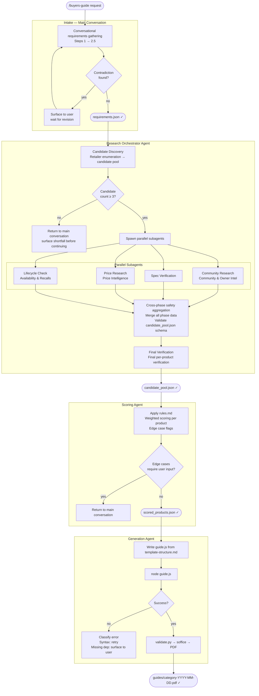

# Buyers Guide — Agent Architecture Design

**Date:** 2026-03-17
**Status:** Approved

---

## Problem Statement

The buyers-guide skill has a structural research ceiling. Behavioral instructions ("search retailer-specific results") can be skipped. The Micro Center gap — where the best prebuilt PC option was invisible to generic editorial searches — is not a Micro Center problem. It is a symptom of a methodology that relies on search results biased toward products with high marketing spend. Any retailer that doesn't pay for editorial coverage is systematically invisible regardless of how many instructions are added.

The fix is structural: retailer enumeration must be an auditable, required output produced *before* any product searching begins. An agent with an output contract cannot skip this step. A skill with an instruction can.

---

## Architecture



---

## Agent Contracts

Every stage has a defined input schema and output schema. Stages are separated by schema validation — a malformed output from one stage does not silently corrupt the next.

### Intake → `requirements.json`

```json
{
  "category": "string",
  "budget": {
    "amount": "number",
    "currency": "string",
    "format": "string — e.g. 'under $150'"
  },
  "region": "string",
  "hard_filters": ["string"],
  "existing_hardware": "string | null",
  "use_case": "string",
  "intake_complete": "boolean"
}
```

**Stopping condition:** Intake is complete when `intake_complete: true` is set — triggered when all of the following are confirmed: category, budget, region, hard filters, existing hardware (or explicitly null), use case. Claude sets this flag explicitly; it does not infer completion.

---

### Research Orchestrator → Candidate Discovery → `research_foundation.json`

Produced **before** any product searching begins. This is the structural fix — retailer enumeration is an auditable required output, not an instruction.

```json
{
  "retailers": ["string — every retailer that carries this category in this region"],
  "retailer_minimum": 3,
  "category_sources": ["string — Spec Verification sources for this category"],
  "editorial_sources_found": ["string — used to exclude from candidate deduplication"],
  "candidates": [
    {
      "name": "string",
      "source": "string — where found",
      "source_type": "editorial | retailer | community | manufacturer"
    }
  ]
}
```

**Retailer enumeration rule:** The `retailers` list must contain at least 3 entries and must include at least one non-editorial source (retailer or manufacturer direct). If only editorial sources are found, Candidate Discovery is not complete.

---

### Research Orchestrator → Final → `candidate_pool.json`

```json
{
  "requirements": "requirements.json reference",
  "research_foundation": "research_foundation.json reference",
  "candidates": [
    {
      "name": "string",
      "community_research": {
        "community_sentiment": "positive | mixed | negative | insufficient_data",
        "confirmed_issues": ["string — each confirmed by 3+ sources"],
        "sources": ["string"]
      },
      "spec_verification": {
        "specs": {"key_spec": {"status": "verified | diverges | inconclusive | no_source", "claimed": "value", "measured": "value", "source": "url"}},
        "conditional_specs": ["string"],
        "sources_checked": ["string"],
        "flags": ["string"]
      },
      "price_research": {
        "current_price": "number",
        "currency": "string",
        "retailer": "string",
        "retailer_url": "string",
        "in_stock": "boolean",
        "price_history": "string",
        "sale_eligible": "boolean",
        "consider_waiting": "boolean | string",
        "in_budget_only_at_sale_price": "boolean",
        "purchase_options": [{"retailer": "string", "url": "string", "price": "number", "in_stock": "boolean", "verified_live": "boolean", "store_location": "string | null"}]
      },
      "lifecycle_check": {
        "recall_status": "clear | recalled | check_failed",
        "recall_source": "string | null",
        "lifecycle_status": "current | discontinued | successor_imminent | successor_announced",
        "ownership_change": "string | null"
      },
      "final_verification": {
        "model_verified": "boolean",
        "url_verified": "boolean",
        "regional_spec_match": "boolean",
        "price_verified_live": "boolean",
        "price_at_generation": "number | null",
        "notes": "string | null"
      },
      "safety_flag": "boolean — set by orchestrator after cross-track aggregation"
    }
  ]
}
```

**Candidate pool ceiling:** Maximum 15 candidates passed to parallel subagents. If Candidate Discovery finds more, trim to top 15 by source diversity (prioritise retailer-sourced candidates over editorial duplicates).

**Cross-phase safety aggregation:** After Community Research / Spec Verification / Price Research / Lifecycle Check return, the orchestrator checks all phase data — not just Lifecycle Check — for safety signals. Any mention of fire risk, injury, recall, or regulatory action in *any* phase sets `safety_flag: true`.

---

### Scoring Agent → `scored_products.json`

```json
{
  "ranked_products": [
    {
      "name": "string",
      "rank": "number",
      "score": "number",
      "score_breakdown": {
        "price_to_value": "number",
        "spec_integrity": "number",
        "community_reception": "number",
        "feature_quality": "number",
        "availability": "number",
        "na_factors": ["string"]
      },
      "penalties": ["string"],
      "flags": {
        "safety_excluded": "boolean",
        "stretch_pick": "boolean",
        "dominant_winner": "boolean",
        "consider_waiting": "boolean | string",
        "all_below_6": "boolean"
      }
    }
  ],
  "guide_meta": {
    "product_count": "number",
    "category_type": "focused | broad | competitive",
    "category_type_rationale": "string",
    "edge_cases_requiring_user_input": ["string"]
  }
}
```

**Category type heuristic:** `competitive` if candidate pool ≥ 10 products and budget ≥ regional median for category. `focused` if hard filters reduce pool to ≤ 5 products or category is inherently narrow. `broad` otherwise. Rationale must be stated.

---

### Generation Agent → `guides/[category-slug]-[YYYY-MM-DD].pdf`

Output directory: `guides/` relative to project root. Files named `[category-slug]-[YYYY-MM-DD].pdf` — no overwrites on repeat runs.

**Error classification:**
- Syntax error in `guide.js` → Generation Agent retries once with self-correction
- Missing Node module → Surface to user with install instruction
- LibreOffice not found → Surface to user with install instruction; do not retry
- Validation failure → Generation Agent fixes and reruns; surfaces if failure persists after two attempts

---

## Known Constraints and Resolution Order

### Must be resolved before building

| Constraint | Resolution |
|---|---|
| Schema validation between stages | JSON schema files per contract; validation step between each agent handoff |
| Eval runner doesn't exist | Build eval runner as first deliverable before agent code |
| Intake stopping condition | Explicit `intake_complete` flag in contract; Claude sets it, does not infer |
| Candidate pool size ceiling | Hard cap at 15; trim by source diversity |
| Scoring category judgment | Defined heuristic in contract (see above) |

### Resolve during building

| Constraint | Resolution |
|---|---|
| Context window management | Spec Verification subagent processes max 8 products; if pool > 8, run two passes |
| Cross-phase safety aggregation | Orchestrator checks all phase outputs, not just Lifecycle Check |
| Generation error recovery | Defined error classification and retry policy (see above) |
| Generation Agent Claude.ai path dependencies | Audit template-structure.md for `/mnt/` paths; replace with local equivalents |

### Resolve after first working version

| Constraint | Resolution |
|---|---|
| Mid-research requirement change cancellation | Define cancellation signal for in-flight subagents |
| Token cost awareness | Log token usage per stage; set soft warning threshold |

---

## Eval Redesign

The existing `buyers-guide-evals.json` tests outputs (specific brands, specific link formats). This is the same structural failure as the Micro Center patch — regression tests for known failures, not tests for the underlying capability.

**Eval design principle:** Test that the *process* was followed and the *contracts* are valid. Not that specific products appeared.

**New eval categories:**

**Contract validation tests** — assert output JSON matches schema at every stage boundary.

**Process adherence tests:**
- `research_foundation.json` was produced before any candidate names appear in the orchestrator's context
- `retailers` list contains ≥ 3 entries with ≥ 1 non-editorial source
- Candidate pool contains ≥ 1 product absent from the top 3 editorial roundups for the category
- All four parallel subagents returned data (no silent skip)
- `safety_flag` was checked across all phases, not just Lifecycle Check

**Edge case routing tests** — assert that when an edge case flag is set, the correct path is taken (not that the edge case produced a specific output).

**Regression tests** — the existing 15 tests are kept but reclassified as regression tests, not primary coverage.

---

## File Structure

```
buyer-guide/
├── CLAUDE.md                          # /buyers-guide trigger + agent file paths
├── guides/                            # PDF output directory
├── buyers-guide-refactored/
│   └── buyers-guide/
│       ├── SKILL.md                   # Becomes Intake Agent instructions
│       ├── template-structure.md      # Generation Agent dependency
│       └── references/
│           ├── research.md            # Research Orchestrator + subagent instructions
│           └── rules.md               # Scoring Agent instructions
├── agents/
│   ├── schemas/
│   │   ├── requirements.schema.json
│   │   ├── research_foundation.schema.json
│   │   ├── candidate_pool.schema.json
│   │   └── scored_products.schema.json
│   └── validate.py                    # Schema validation between stages
├── docs/
│   └── plans/
│       └── 2026-03-17-agent-architecture-design.md
└── evals/
    ├── buyers-guide-evals.json        # Existing 15 tests (reclassified as regression)
    ├── contract-evals.json            # New: contract validation tests
    ├── process-evals.json             # New: process adherence tests
    └── runner.py                      # Eval runner (first deliverable)
```

---

## Migration Path to Web App

When ready to expose this as a web app:

1. Each agent's instructions (the markdown files) become system prompts in Anthropic Python SDK API calls
2. The output contracts (JSON schemas) become the structured output format for each API call
3. The orchestrator's parallel subagent spawning becomes `asyncio.gather()` over async Claude API calls
4. The eval runner runs against the API pipeline, not Claude Code

No redesign required. The agent contracts and eval system built here are the web app's API contracts.
